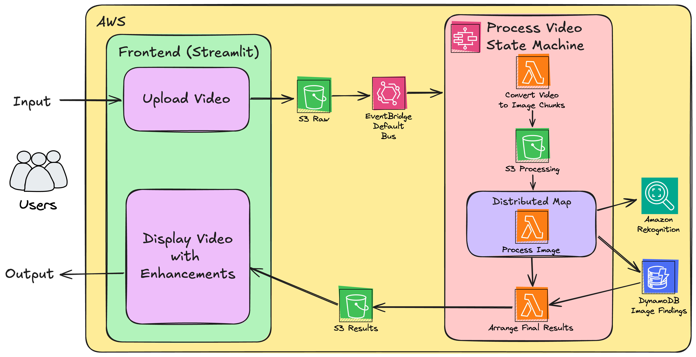
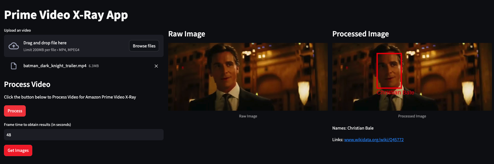
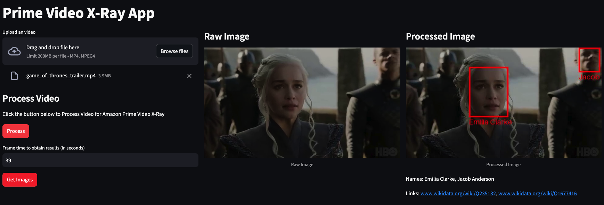
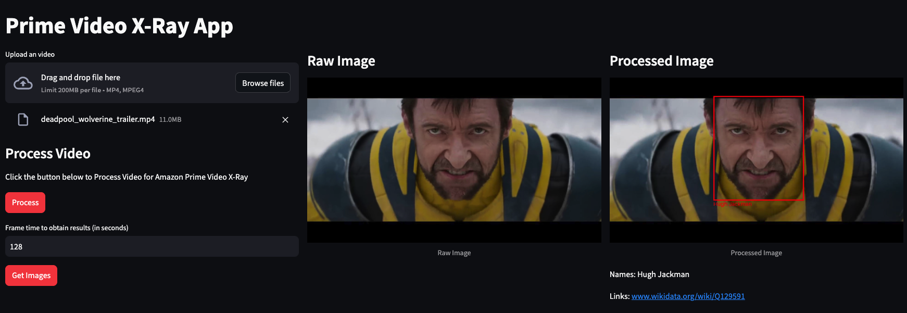

# AWS-PRIME-VIDEO-XRAY-CLONE

Fun OpenSource project to illustrate how "Amazon Prime Video X-Ray Functionality" works.

> Disclaimer: this is NOT the real X-Ray solution, it's just a clone to explore AWS capabilities.

## Architecture

 <br>

## Example Results

You will obtain an interactive UI to upload videos and then get the detected elements from each scene:

 <br>

 <br>

 <br>

### How to deploy this project?

Clone the repository:

```bash
git clone https://github.com/san99tiago/aws-prime-video-xray-clone
cd aws-prime-video-xray-clone
```

Then, proceed to install the necessary dependencies:

```bash
# Install Poetry and Python dependencies
pip install poetry
poetry shell
poetry install
```

Afterwards, configure the AWS Credentials locally, so that you can deploy to the correct AWS Account/Region:

```bash
# Replace the values with the ones accordingly to your AWS Credentials...
export AWS_DEFAULT_REGION="us-east-1"
export AWS_ACCESS_KEY_ID="paste-your-access-key"
export AWS_SECRET_ACCESS_KEY="paste-your-secret-access-key"
export AWS_SESSION_TOKEN="paste-your-session-token"
```

Finally, proceed to deploy the application as follows:

```bash
cdk deploy
```

From the outputs, copy the URL and start using the Amazon Prime X-Ray clone. Enjoy!

## LICENSE

Copyright 2024 Santiago Garcia Arango

Copyright 2024 Santiago Castellanos
